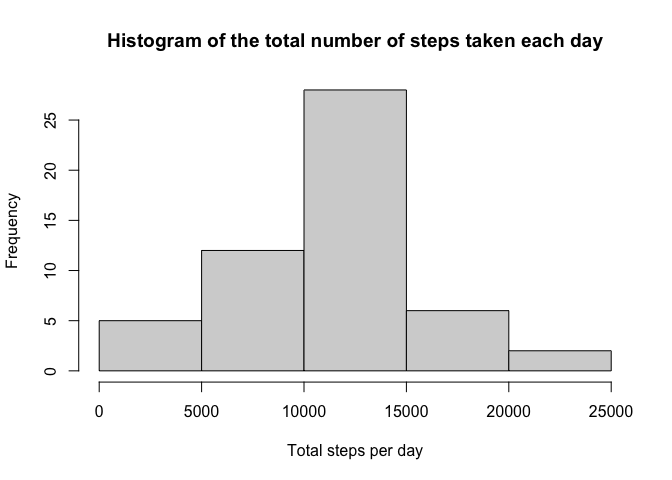
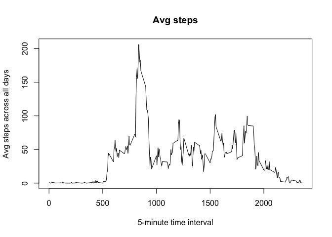
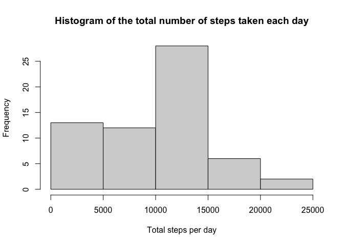
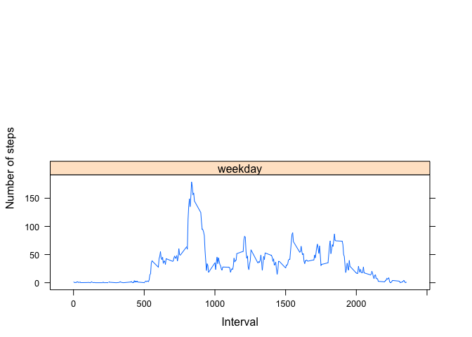

library(ggplot2)
library(scales)
library(Hmisc)

## Loading and preprocessing the data

```r
if(!file.exists('activity.csv')){
    unzip('activity.zip')
}
data <- read.csv('activity.csv')
```

## What is mean total number of steps taken per day?

```r
sum_steps <- aggregate(steps ~ date, data=data, FUN="sum", na.rm=TRUE)
hist(sum_steps$steps, main="Histogram of the total number of steps taken each day", xlab="Total steps per day")
```

<!-- -->

```r
mean(sum_steps$steps)
```

```
## [1] 10766.19
```

```r
median(sum_steps$steps)
```

```
## [1] 10765
```

## What is the average daily activity pattern?

```r
min5avg <- aggregate(steps ~ interval, data=data, FUN="mean", na.rm=TRUE)
plot(min5avg$interval,min5avg$steps,type = "l",main="Avg steps",xlab="5-minute time interval",ylab="Avg steps across all days")
```

<!-- -->

```r
min5avg$interval[which.max(min5avg$steps)]
```

```
## [1] 835
```


## Imputing missing values

```r
sum(is.na(data$steps))
```

```
## [1] 2304
```

```r
data_merge <- merge(data,min5avg,by="interval")
data_merge$steps.x[is.na(data_merge$steps.x)]<-data_merge$steps.y
```

```
## Warning in data_merge$steps.x[is.na(data_merge$steps.x)] <- data_merge$steps.y:
## число единиц для замены не является произведением длины замены
```

```r
keep <- c("interval","steps.x","date")
new_data<-data_merge[keep]
colnames(new_data) <- c("interval","steps","date")
library(plyr)
new_data<-arrange(new_data,date,interval)
new_sum_dailysteps <- aggregate(steps ~ date, data=new_data, FUN="sum", na.rm=TRUE)
hist(new_sum_dailysteps$steps,main="Histogram of the total number of steps taken each day", xlab="Total steps per day")
```

<!-- -->

```r
mean(new_sum_dailysteps$steps)
```

```
## [1] 9371.437
```

```r
median(new_sum_dailysteps$steps)
```

```
## [1] 10395
```


## Are there differences in activity patterns between weekdays and weekends?

```r
wde<-lapply(as.Date(new_data$date), function(x) if (weekdays(x)<"Saturday") {return("weekday")} else {return("weekend")})
new_data$day_type<-unlist(wde)
new_avg_5minsteps <- aggregate(steps ~ interval+day_type, data=new_data, FUN="mean", na.rm=TRUE)
library(lattice)
xyplot(steps ~ interval | day_type, data=new_avg_5minsteps, type = "l", layout = c(1, 2), xlab="Interval",ylab="Number of steps")
```

<!-- -->

